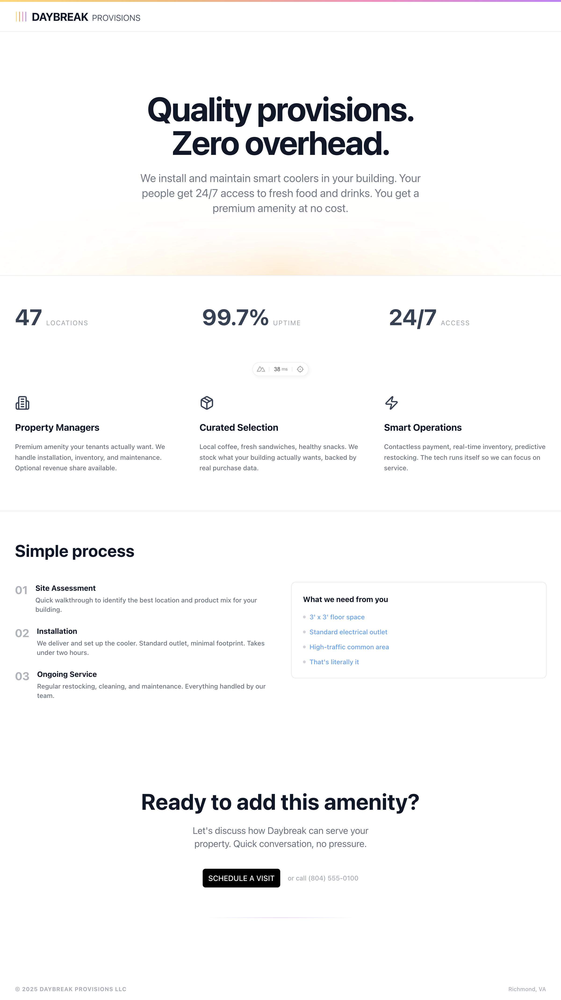

# Daybreak Provisions - Company Website



A modern, responsive landing page for Daybreak Provisions LLC - a smart cooler vending company serving upscale properties in Richmond, VA.

## About Daybreak Provisions

Daybreak Provisions provides premium smart cooler amenities for apartment buildings, offices, and healthcare facilities. We handle everything from installation to maintenance, offering property managers a zero-cost amenity that increases tenant satisfaction and property value.

**Key Value Propositions:**
- Zero cost to property managers
- 24/7 access to quality food and drinks
- Modern, contactless payment experience
- Data-driven inventory optimization
- Professional aesthetic (no gaudy vending machine branding)

## Tech Stack

- **Framework**: [Nuxt 4](https://nuxt.com/) - Vue.js framework with SSR/SSG
- **UI Library**: [Nuxt UI](https://ui.nuxt.com/) - Beautiful components built on Tailwind CSS
- **Styling**: [Tailwind CSS](https://tailwindcss.com/) - Utility-first CSS framework
- **Icons**: [Lucide Icons](https://lucide.dev/) via Nuxt UI
- **Deployment**: Ready for Vercel, Netlify, or any Node.js hosting

## Getting Started

### Prerequisites

- Node.js 18+ 
- npm, yarn, or pnpm

### Installation

1. Clone the repository:
```bash
git clone <repository-url>
cd DaybreakProvisionsSite
```

2. Navigate to the Nuxt app directory:
```bash
cd nuxt-app
```

3. Install dependencies:
```bash
npm install
# or
yarn install
# or
pnpm install
```

4. Start the development server:
```bash
npm run dev
# or
yarn dev
# or
pnpm dev
```

5. Open [http://localhost:3000](http://localhost:3000) in your browser.

## Available Scripts

In the `nuxt-app` directory:

- `npm run dev` - Start development server
- `npm run build` - Build for production
- `npm run preview` - Preview production build locally
- `npm run postinstall` - Prepare Nuxt (runs automatically after install)

## Features

### Current Implementation
- **Responsive Design**: Mobile-first approach with Tailwind CSS
- **Modern Components**: Built with Nuxt UI component library
- **Performance Optimized**: SSR/SSG ready with Nuxt 4
- **Accessibility**: WCAG compliant components from Nuxt UI
- **SEO Ready**: Meta tags, structured data, and semantic HTML

### Page Sections
1. **Hero Section**: Value proposition with gradient background effect
2. **Stats Section**: Key metrics (47 locations, 99.7% uptime, 24/7 access)
3. **Three Pillars**: Benefits for property managers, product curation, smart operations
4. **Simple Process**: 3-step installation and service process
5. **Call-to-Action**: Contact form with phone number alternative
6. **Footer**: Company info and branding

## Design System

The site follows a clean, professional design system:

- **Typography**: System fonts with clear hierarchy
- **Colors**: Nuxt UI color palette (primary, secondary, neutral variants)
- **Spacing**: Consistent Tailwind spacing scale
- **Components**: Leverages Nuxt UI components for consistency
- **Brand Elements**: Custom logo components and gradient accents

See `docs/description.md` for detailed brand guidelines and business context.

## Deployment

### Vercel (Recommended)
1. Connect your GitHub repository to Vercel
2. Set build command: `cd nuxt-app && npm run build`
3. Set output directory: `nuxt-app/.output/public`
4. Deploy automatically on push to main

### Netlify
1. Connect repository to Netlify
2. Set build command: `cd nuxt-app && npm run build`
3. Set publish directory: `nuxt-app/.output/public`

### Other Platforms
The site generates static files and can be deployed to any static hosting service or Node.js environment.

## Future Enhancements

- [ ] Contact form integration (Netlify Forms or API endpoint)
- [ ] Calendly integration for scheduling
- [ ] Internal pages (about, services, locations)
- [ ] Blog/news section
- [ ] Customer testimonials
- [ ] Location-specific pages
- [ ] Analytics integration (Plausible or Simple Analytics)

## Contributing

1. Create a feature branch from `main`
2. Make your changes in the `nuxt-app` directory
3. Test locally with `npm run dev`
4. Submit a pull request with a clear description

## Contact

**Daybreak Provisions LLC**  
Richmond, VA  
Email: kyle@daybreakprovisions.com

---

Built with ❤️ using Nuxt 4 and Nuxt UI
